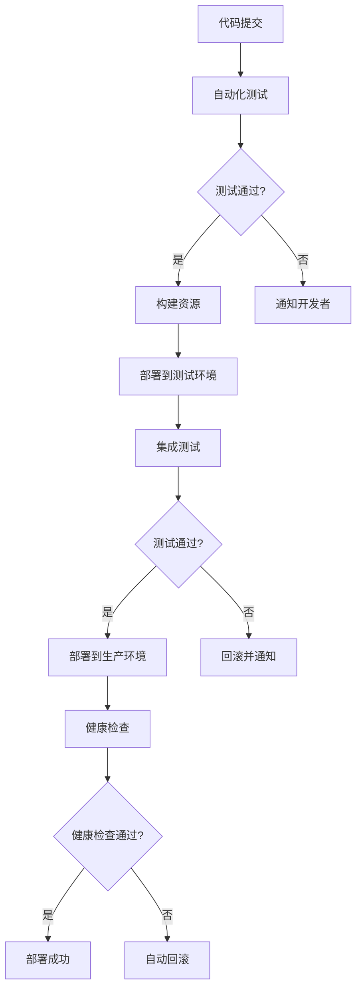

# 测试和部署体系文档

## 概述

本文档详细描述了LED网站的完整测试和部署体系，包括自动化测试框架、持续集成流程、部署策略和监控系统。该体系确保代码质量、系统稳定性和部署可靠性。

## 测试体系架构

### 测试金字塔

```
    /\
   /  \     E2E Tests (少量)
  /____\    
 /      \   Integration Tests (适量)
/__________\ Unit Tests (大量)
```

#### 单元测试 (Unit Tests)
- **覆盖率目标**: 80%以上
- **测试范围**: 独立函数、类方法、组件逻辑
- **工具**: 自定义测试框架 + Jest (可选)
- **运行频率**: 每次代码提交

#### 集成测试 (Integration Tests)
- **测试范围**: 模块间交互、API集成、数据流
- **工具**: 自定义测试框架
- **运行频率**: 每次构建

#### 端到端测试 (E2E Tests)
- **测试范围**: 完整用户流程、跨浏览器兼容性
- **工具**: Playwright/Cypress (推荐)
- **运行频率**: 部署前

### 测试分类

#### 功能测试
- **核心功能测试**: 导航、搜索、对比、表单提交
- **高级功能测试**: 高级搜索、产品对比、移动端功能
- **业务流程测试**: 用户询盘流程、产品浏览流程

#### 非功能测试
- **性能测试**: 页面加载时间、内存使用、响应时间
- **安全测试**: XSS防护、输入验证、数据安全
- **可访问性测试**: WCAG合规性、键盘导航、屏幕阅读器
- **兼容性测试**: 浏览器兼容、设备适配、响应式设计

## 自动化测试框架

### 框架特性

#### 核心功能
- **测试发现**: 自动发现和注册测试用例
- **并行执行**: 支持并行运行多个测试
- **结果报告**: 详细的测试结果和覆盖率报告
- **失败重试**: 自动重试失败的测试用例

#### 测试类型支持
```javascript
// 单元测试示例
testFramework.addTest('Search Filter Logic', 'unit', async () => {
    const result = await testSearchFilters();
    return {
        success: result.isValid,
        message: result.message,
        details: result.details
    };
});

// 集成测试示例
testFramework.addTest('Search Integration', 'integration', async () => {
    const searchResult = await performSearch('LED display');
    const hasResults = searchResult.length > 0;
    return {
        success: hasResults,
        message: `Found ${searchResult.length} results`
    };
});
```

#### 测试工具类
- **Mock工具**: 模拟API调用、用户交互
- **断言库**: 丰富的断言方法
- **测试数据**: 标准化的测试数据集
- **环境管理**: 测试环境隔离和清理

### 测试执行策略

#### 测试触发条件
1. **代码提交**: 运行单元测试和快速集成测试
2. **Pull Request**: 运行完整测试套件
3. **定时任务**: 每日运行完整测试和性能测试
4. **部署前**: 运行所有测试包括E2E测试

#### 测试环境
- **开发环境**: 本地开发时的快速测试
- **测试环境**: CI/CD流水线中的自动化测试
- **预发布环境**: 生产环境的完整模拟测试

## 部署体系

### 部署策略

#### 蓝绿部署 (Blue-Green Deployment)
- **零停机部署**: 确保服务持续可用
- **快速回滚**: 出现问题时快速切换回稳定版本
- **风险降低**: 新版本在独立环境中验证

#### 部署流程


### 部署配置管理

#### 环境配置
```json
{
  "environments": {
    "development": {
      "url": "http://localhost:8000",
      "debug": true,
      "minify": false
    },
    "staging": {
      "url": "https://staging.example.com",
      "debug": false,
      "minify": true
    },
    "production": {
      "url": "https://www.example.com",
      "debug": false,
      "minify": true
    }
  }
}
```

#### 构建优化
- **资源压缩**: CSS/JS文件压缩和混淆
- **图片优化**: 自动压缩和格式转换
- **缓存策略**: 静态资源版本控制和缓存
- **CDN集成**: 静态资源CDN分发

### 部署脚本功能

#### 核心功能
- **环境验证**: 检查目标环境配置和依赖
- **自动化测试**: 部署前运行完整测试套件
- **资源构建**: 编译、压缩和优化资源文件
- **健康检查**: 部署后验证服务可用性

#### 安全特性
- **权限控制**: 基于角色的部署权限管理
- **审计日志**: 完整的部署操作记录
- **回滚机制**: 自动和手动回滚支持
- **备份管理**: 部署前自动备份

## 持续集成/持续部署 (CI/CD)

### CI/CD流水线

#### 持续集成阶段
1. **代码检查**: 代码风格、语法检查
2. **单元测试**: 快速单元测试执行
3. **代码覆盖率**: 测试覆盖率分析
4. **安全扫描**: 代码安全漏洞检测

#### 持续部署阶段
1. **集成测试**: 完整功能测试
2. **性能测试**: 性能基准测试
3. **安全测试**: 安全漏洞扫描
4. **部署执行**: 自动化部署到目标环境

### 质量门禁

#### 代码质量标准
- **测试覆盖率**: 最低80%
- **代码复杂度**: 圈复杂度 < 10
- **重复代码**: 重复率 < 3%
- **安全漏洞**: 零高危漏洞

#### 性能标准
- **首屏加载时间**: < 2秒
- **最大内容绘制**: < 4秒
- **首次输入延迟**: < 100ms
- **累积布局偏移**: < 0.1

## 监控和告警

### 应用监控

#### 性能监控
- **页面性能**: 加载时间、渲染性能
- **用户体验**: Core Web Vitals指标
- **资源使用**: 内存、CPU使用情况
- **错误监控**: JavaScript错误、网络错误

#### 业务监控
- **用户行为**: 页面访问、功能使用统计
- **转化率**: 询盘转化、用户留存
- **搜索分析**: 搜索关键词、结果点击率
- **设备分析**: 设备类型、浏览器分布

### 告警机制

#### 告警级别
- **严重**: 服务不可用、数据丢失
- **警告**: 性能下降、错误率上升
- **信息**: 部署完成、定期报告

#### 通知渠道
- **即时通知**: Slack、钉钉、微信
- **邮件通知**: 详细错误报告
- **短信通知**: 紧急故障通知
- **仪表板**: 实时监控面板

## 测试数据管理

### 测试数据策略

#### 数据分类
- **静态数据**: 产品信息、配置数据
- **动态数据**: 用户输入、搜索记录
- **敏感数据**: 用户信息、联系方式

#### 数据生成
- **自动生成**: 使用工厂模式生成测试数据
- **数据模板**: 标准化的数据模板
- **数据变异**: 边界值、异常数据测试
- **数据清理**: 测试后自动清理数据

### 数据隐私保护

#### 敏感数据处理
- **数据脱敏**: 生产数据脱敏处理
- **数据加密**: 敏感数据加密存储
- **访问控制**: 基于角色的数据访问
- **审计追踪**: 数据访问日志记录

## 性能测试

### 性能测试类型

#### 负载测试
- **正常负载**: 模拟正常用户访问量
- **峰值负载**: 模拟高峰期访问量
- **压力测试**: 测试系统极限承载能力
- **稳定性测试**: 长时间运行稳定性

#### 性能指标
- **响应时间**: 平均响应时间、95%分位数
- **吞吐量**: 每秒请求数、并发用户数
- **资源使用**: CPU、内存、网络使用率
- **错误率**: 请求失败率、超时率

### 性能优化

#### 前端优化
- **资源优化**: 图片压缩、代码分割
- **缓存策略**: 浏览器缓存、CDN缓存
- **懒加载**: 图片、组件按需加载
- **预加载**: 关键资源预加载

#### 后端优化
- **数据库优化**: 索引优化、查询优化
- **缓存机制**: Redis缓存、内存缓存
- **负载均衡**: 请求分发、故障转移
- **异步处理**: 非阻塞I/O、消息队列

## 安全测试

### 安全测试范围

#### Web安全测试
- **XSS防护**: 跨站脚本攻击防护
- **CSRF防护**: 跨站请求伪造防护
- **SQL注入**: 数据库注入攻击防护
- **文件上传**: 恶意文件上传防护

#### 数据安全测试
- **数据传输**: HTTPS加密传输
- **数据存储**: 敏感数据加密存储
- **访问控制**: 用户权限验证
- **审计日志**: 安全事件记录

### 安全扫描工具

#### 静态分析
- **代码扫描**: 源代码安全漏洞扫描
- **依赖检查**: 第三方库安全漏洞检查
- **配置审计**: 安全配置检查
- **合规检查**: 安全标准合规性检查

#### 动态分析
- **渗透测试**: 模拟攻击测试
- **漏洞扫描**: 运行时漏洞检测
- **安全监控**: 实时安全威胁监控
- **事件响应**: 安全事件处理流程

## 文档和培训

### 文档体系

#### 技术文档
- **API文档**: 接口规范和使用说明
- **部署文档**: 部署流程和配置说明
- **测试文档**: 测试用例和测试报告
- **故障排除**: 常见问题和解决方案

#### 操作手册
- **用户手册**: 功能使用说明
- **管理员手册**: 系统管理和维护
- **开发指南**: 开发规范和最佳实践
- **应急预案**: 故障处理和恢复流程

### 团队培训

#### 技能培训
- **测试技能**: 测试方法和工具使用
- **部署技能**: 部署流程和工具操作
- **监控技能**: 监控系统使用和分析
- **安全意识**: 安全威胁和防护措施

#### 流程培训
- **开发流程**: 代码开发和提交规范
- **测试流程**: 测试执行和报告流程
- **部署流程**: 部署操作和验证流程
- **应急流程**: 故障处理和恢复流程

## 最佳实践

### 测试最佳实践

#### 测试设计
1. **测试优先**: 先写测试再写代码
2. **独立性**: 测试用例相互独立
3. **可重复**: 测试结果可重复验证
4. **快速反馈**: 快速发现和定位问题

#### 测试维护
1. **定期更新**: 随功能变更更新测试
2. **重构测试**: 消除重复和冗余测试
3. **性能优化**: 优化测试执行时间
4. **文档同步**: 保持测试文档更新

### 部署最佳实践

#### 部署安全
1. **权限最小化**: 最小权限原则
2. **环境隔离**: 开发、测试、生产环境隔离
3. **配置管理**: 配置文件版本控制
4. **审计追踪**: 完整的操作日志

#### 部署可靠性
1. **自动化**: 减少人工操作错误
2. **幂等性**: 重复执行结果一致
3. **回滚能力**: 快速回滚机制
4. **监控验证**: 部署后自动验证

## 工具和技术栈

### 测试工具
- **单元测试**: Jest, Mocha, 自定义框架
- **集成测试**: Supertest, 自定义框架
- **E2E测试**: Playwright, Cypress
- **性能测试**: Lighthouse, WebPageTest

### 部署工具
- **CI/CD**: GitHub Actions, Jenkins, GitLab CI
- **容器化**: Docker, Kubernetes
- **基础设施**: Terraform, Ansible
- **监控**: Prometheus, Grafana, ELK Stack

### 开发工具
- **版本控制**: Git, GitHub/GitLab
- **代码质量**: ESLint, Prettier, SonarQube
- **包管理**: npm, yarn
- **构建工具**: Webpack, Vite, Rollup

## 未来规划

### 技术升级
- **云原生**: 容器化部署和微服务架构
- **AI测试**: 智能测试用例生成和执行
- **边缘计算**: CDN和边缘节点部署
- **DevSecOps**: 安全左移和自动化安全测试

### 流程改进
- **测试自动化**: 提高自动化测试覆盖率
- **部署频率**: 增加部署频率和可靠性
- **监控智能化**: 智能告警和自动修复
- **团队协作**: 改进跨团队协作流程

## 结论

完整的测试和部署体系是现代Web应用成功的关键。通过自动化测试、持续集成、可靠部署和全面监控，我们确保了LED网站的高质量、高可用性和持续改进。

该体系不仅提高了开发效率和代码质量，还降低了部署风险和运维成本。随着技术的发展和业务的增长，我们将持续优化和完善这个体系，为用户提供更好的服务体验。